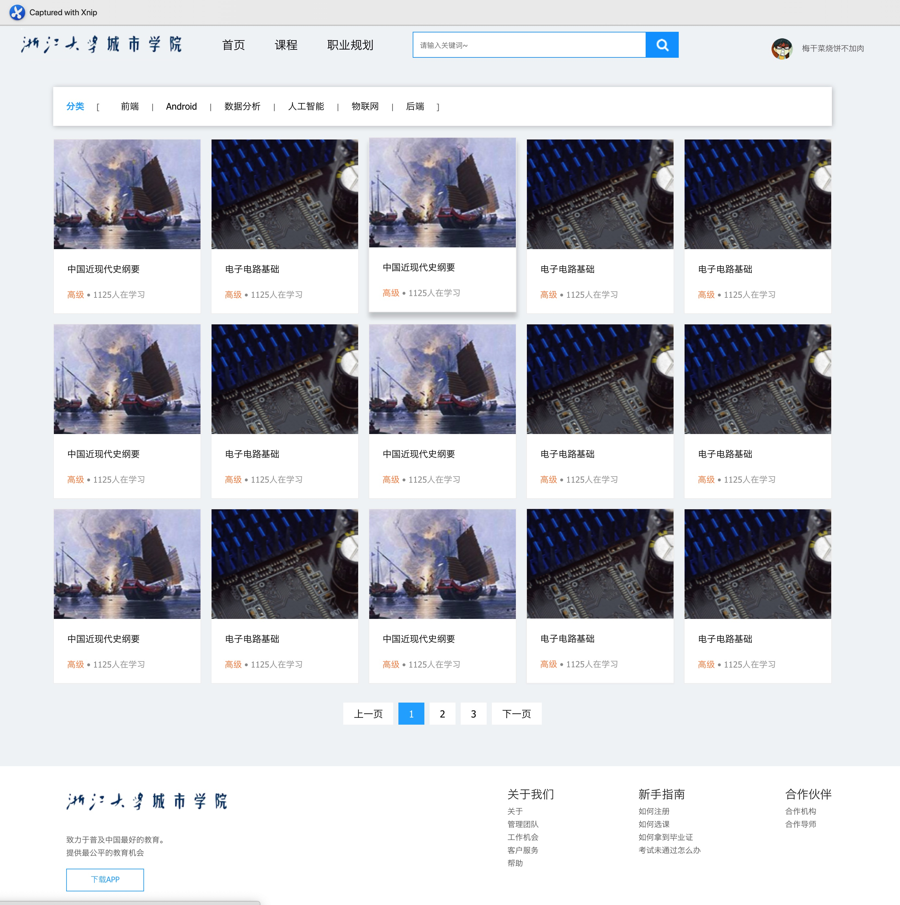
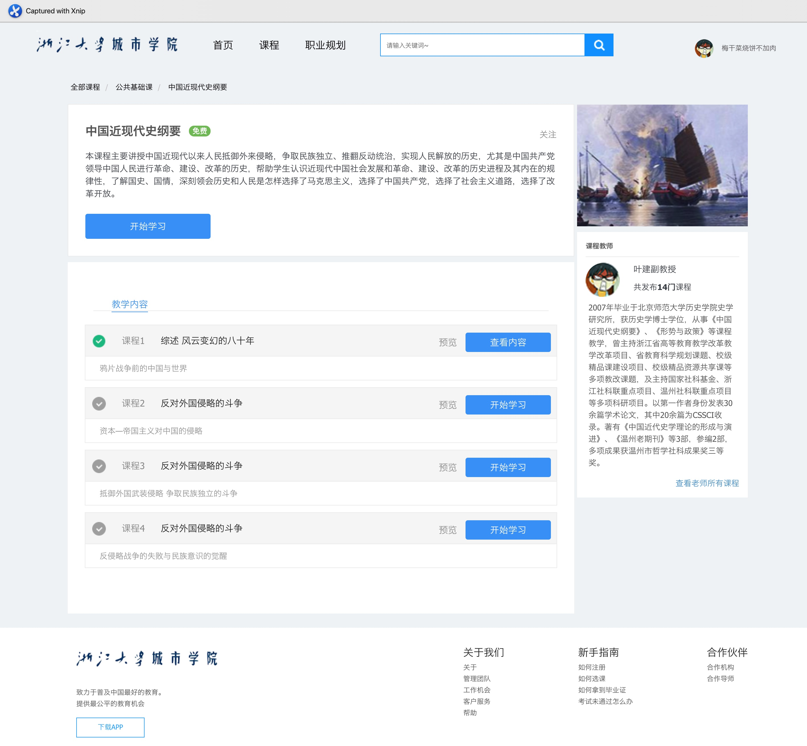
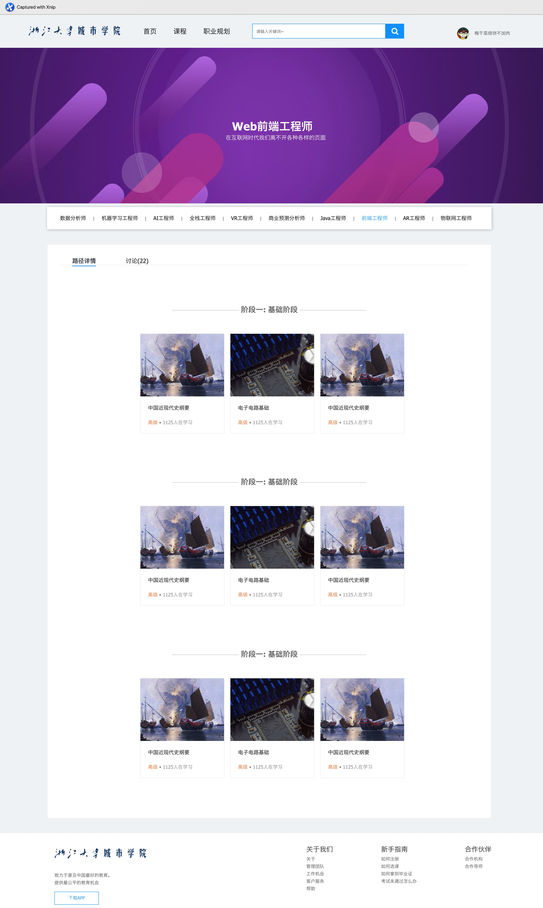
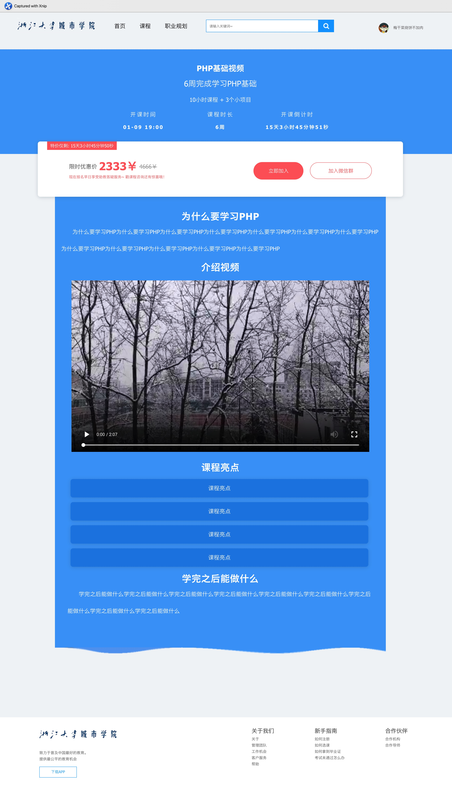

## 概览
本项目部分完成了一个在线课堂网站的前端页面, 包括首页/部课程/课程详情/职业规划和课程促销5个页面, 使用纯HTML+CSS+JavaScript实现, 无任何外部框架. 未做任何响应式适配.

## 详情

目录结构
```
.
├── README.md 
├── course.html // 课程详情页
├── courses.html // 所有课程页
├── css
│   ├── base.css // 所有页面公有样式
│   ├── course.css // 课程详情页样式
│   ├── index.css // 首页样式
│   ├── modal.css // modal浮窗样式
│   ├── onsale.css // 促销页样式
│   └── plan.css // 职业规划样式
├── favicon.ico // 网站ico
├── images // 所有图片
├── index.html // 网站首页
├── onsale.html // 课程促销页
├── plan.html // 职业规划页
└── video // 所有视频
```


项目页面截图与具体实现


### 首页

首页主要由`header`/`banner`/`recommend`/`product`和`footer`五大部分组成, 具体如下所示.
```
.
├── header //页头
│   ├── logo // logo
│   ├── nav //导航栏
│   ├── search // 搜索框
│   └── personal // 个人中心
├── banner // 横额
│   ├── subnav // 侧边导航栏
│   ├── container // 轮播
│   └── schedule // 课程表
├── recommend // 课程推荐
├── product // 部分课程
└── footer // 页脚
    ├── footer-l // 左页脚
    └── footer-r // 右页脚
```
#### 图片轮播的实现:
图片轮播的本质是在显示范围内只有一张图片, 通过修改图片的位置, 同时使用`setInterval`使不同的图片按一定的间隔修改相对位置, 从而实现图片的移动.
同时添加动画, 在一定时间内完成变换. 

### 所有课程
在首页点击`nav`中的课程, 会跳转到所有课程页.


图片悬停在课程选项上时通过`:hover`添加卡片阴影, 和`z`的变换, 实现动效.
复用首页页头与页脚, 在版心部分添加课程分类与所有课程.
在页脚上方添加了用于换页的`pagination` 添加JavaScript后可以用于多页面切换.

### 课程详情页

在首页或者所有课程页后, 会跳转到课程详情页


```
.
├── header //页头
│   ├── logo // logo
│   ├── nav //导航栏
│   ├── search // 搜索框
│   └── personal // 个人中心
├── banner // 横额
│   └── breadcrumb // 面包屑导航栏
├── layout-body // 放置课程的主要信息
├── layout-slide // 放置课程的参考信息, 图片授课老师
└── footer // 页脚
    ├── footer-l // 左页脚
    └── footer-r // 右页脚
```
这里使用了`Modal(模态框)`, 当单击`开始学习`按钮时, 会弹出`Modal`, 显示预览视频.


#### modal的实现
modal本质是一个全屏`div`标签, 最初为`display`属性为`none`, 默认不显示, 使用JS进行DOM操作, 设置监听器, 当监听到用户点击对应按钮, `display`属性改为`block`, 显示出来. 同时设置`background-color`属性, 为背景设置背景色, 实现聚焦的效果. 在modal内部有对应的按钮, 该按钮同样设置过监听器, 当监听到点击后, 将modal的`display`属性设置为`none`, 取消modal的显示.

### 职业规划页
在首页点击职业规划后, 可以跳转到该页. 职业规划页主要提供一个职业不同阶段的学习内容, 并提供对应的课程, 点击对应课程便可跳转到课程详情页.

```
.
├── header //页头
│   ├── logo // logo
│   ├── nav //导航栏
│   ├── search // 搜索框
│   └── personal // 个人中心
├── banner // 横额
├── carrier // 放置各个职业的分类
├── level // 放置该职业的不同阶段学习的课程
└── footer // 页脚
    ├── footer-l // 左页脚
    └── footer-r // 右页脚
```
### 促销页
在首页banner中, 点击轮播图便可跳转到本页. 本页主要提供正在进行促销的课程. 


  
```
.
├── header //页头
│   ├── logo // logo
│   ├── nav //导航栏
│   ├── search // 搜索框
│   └── personal // 个人中心
├── banner // 课程的梗概信息
├── price // 课程的价格信息
├── course-info // 课程的详细信息
└── footer // 页脚
    ├── footer-l // 左页脚
    └── footer-r // 右页脚
```

本页中使用了一个modal, 再点击`加入微信群`按钮后, 弹出modal, modal中为二维码

同时使用JavaScript实现倒计时.

#### 倒计时实现

首先使用`Date`对象的`parse`方法, 将字符串解析为`Date`, 便可获取该对象的timestamp, 为一个`long`
再创建一个`Date`对象, 使两个对象的timestamp相减, 得到相差时间的毫秒数. 通过数学计算得到对应的天/时/分/秒.
最后, 使用`setInterval`方法, 设置每1秒,调用该方法, 不断用DOM更新HTML中的文本, 从而实现倒计时.

